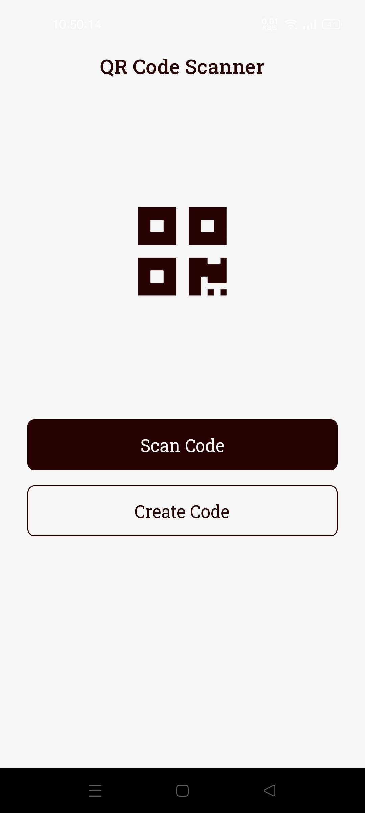
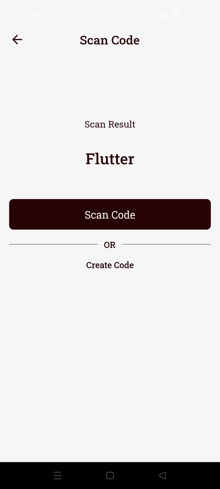
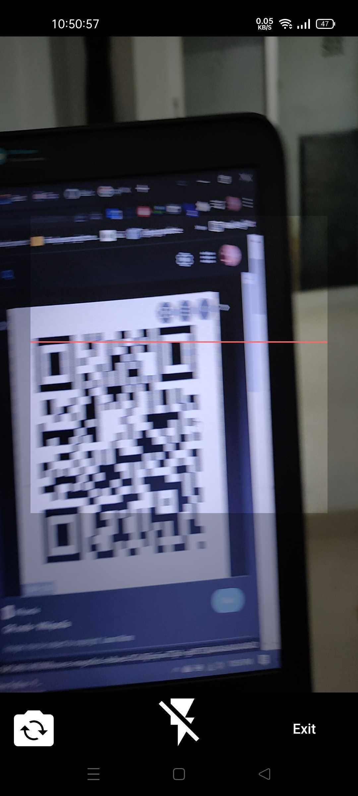
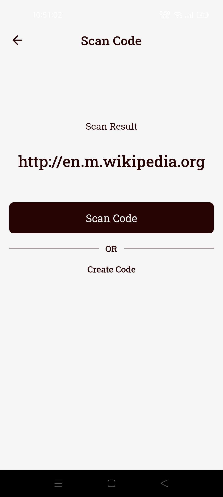
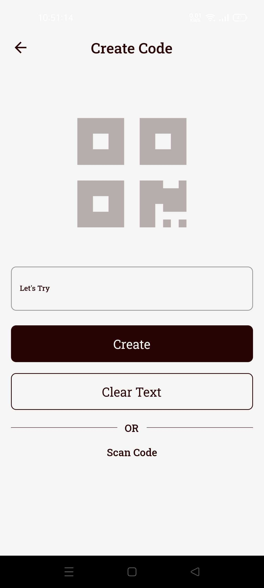
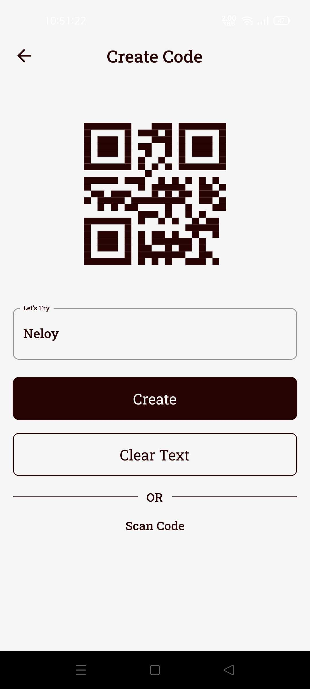

# QR Code Scanner App

This is a flutter application that can scan QR codes, generate QR codes.

## Technologies I use here:
1. Flutter: Frontend Framework.
2. Dart: Programming Language.

## Packages:
1. flutter_barcode_scanner: ^2.0.0
2. barcode_widget: ^2.0.2
3. font_awesome_flutter: ^9.2.0

## Screenshots: 

  
  
  
  
  
  
  

